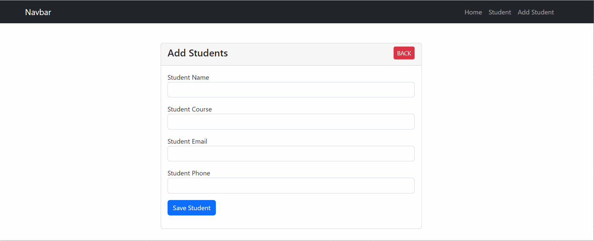
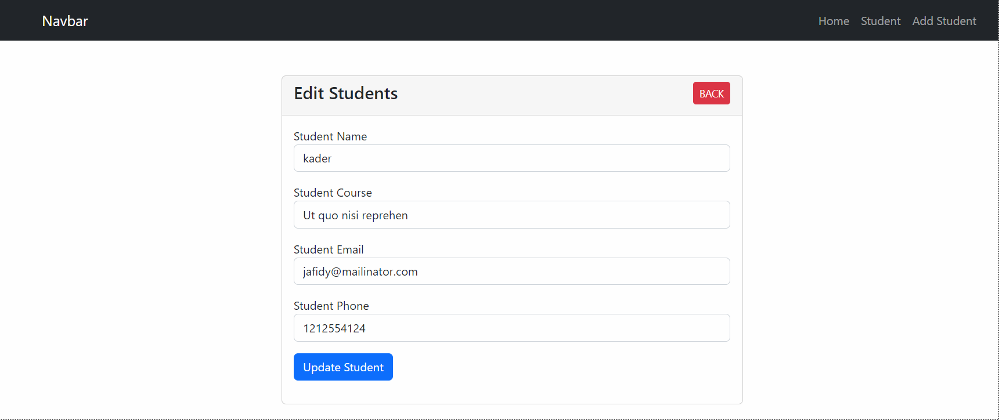

# Simple Students CRUD Project to learn how to consume api which created by laravel and use in react.
## In this project I Used Laravel,React,Axios,Sweetalert.
### Here, Student can add, and delete their Info,also update info if need.

[Student CRUD API/Backend here](https://github.com/kaderabdul79/studentsCRUDBackend)

